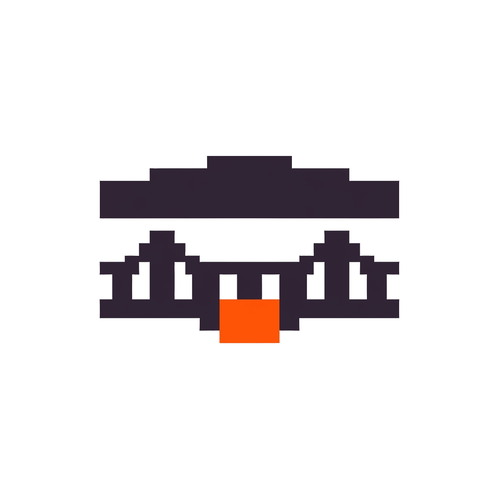

<div align="center">
  
  <p>
    <strong>An OpenAI-compatible facade over a stateful DeepSeek browser tab, written in TypeScript.</strong><br/>
    A zero-runtime-dependency Node bridge plus a Chrome MV3 extension that turn live chat tabs into a
    stateful <code>/v1/chat/completions</code> endpoint — hash-chained session state, fenced-JSON tool-call
    emulation with a bounded repair round, a generation gate that queues what the provider would refuse,
    and an error taxonomy keyed to coding-harness retry semantics (kod / Cline / Aider).
  </p>
  <p>
    
    
    
    
    
    
    
    
  </p>
</div>

---

# Tab Bridge

> [!NOTE]
> Tab Bridge is a working harness: the bridge builds with zero type errors, the full
> test suite passes, and the complete serve → load-extension → drive-DeepSeek loop is
> field-verified against the live web UI. But DeepSeek ships DOM changes without notice —
> selectors are best-effort and fixed in the injector first. See [Project Status](#project-status).

---

## Table of Contents

- [Why Tab Bridge](#why-tab-bridge)
- [Features](#features)
- [Architecture](#architecture)
- [Getting Started](#getting-started)
- [Usage](#usage)
- [Multi-account fleet](#multi-account-fleet)
- [Configuration](#configuration)
- [Reliability and Error Semantics](#reliability-and-error-semantics)
- [Testing](#testing)
- [Fleet runbook](docs/RUNBOOK.md)
- [Project Status](#project-status)

---

## Why Tab Bridge

The OpenAI protocol is stateless by construction; a driven browser tab is the most
stateful client imaginable. Forcing one shape onto the other without an explicit
translation layer produces the classic silent-corruption bugs: duplicated context after
regeneration, wrong context after truncation, phantom history after a restart. Tab
Bridge exists to make that mismatch explicit, bounded, and testable.

- **A facade, not a proxy.** The OpenAI shape is the product surface, never the
  architecture. Five strict layers — L4 facade → L3 session/reconciliation → L2 tool
  emulation → L1 adapter → L0 browser runtime — translate the stateless protocol into
  the stateful world, and only at explicitly designed seams.
- **Session state you can audit.** Every message lands on a per-session blake2b16 hash
  chain (position + content covered). Reconciliation is a total, deterministic function
  of the chain delta and the tab's last output hash: one of exactly four plans, never a
  heuristic guess. Persistence is JSONL of chain digests only — no transcripts — and
  boot replay resumes chains exactly.
- **Tools without a tool-calling API.** Tools are negotiated in-prompt and parsed from
  fenced JSON blocks. Call ids are deterministic (`call_` + blake2b(name, args)[:10]),
  so `tool_call_id` linkage survives restarts. One bounded repair round runs on
  protocol violations; exhaustion degrades to a text completion with an
  `x_bridge_warning` — never a hang.
- **Provider refusals become protocol, not surprises.** Cloudflare challenges, send
  frequency limits, concurrency caps, pool exhaustion, same-session overlap — each maps
  to a specific HTTP status with `Retry-After`, so a coding agent's retry logic can act
  on them cheaply. Never an HTML error page, and an empty successful stream is
  structurally impossible.
- **Queueing where the provider says no.** DeepSeek refuses a third concurrent
  generation; the bridge turns that server-side refusal into client-side FIFO queueing
  that callers observe only as a longer time-to-first-byte.
- **Zero runtime dependencies.** Dev deps are `typescript` and `@types/node`, and that
  is the whole list. The WebSocket server is a hand-rolled RFC 6455 implementation; the
  test suite runs on `node:test` alone.
- **Tested like it will be used.** 258 tests over unit, contract (real HTTP + SSE stack
  against a scripted adapter), and worker-link tiers (real WebSocket against a fake
  extension), plus a 15-scenario E2E over real sockets and a four-tier ladder up to a
  real coding-agent loop.

---

## Features

### OpenAI facade (L4 · `src/facade/`)

- **Full chat-completions semantics** — stream and non-stream, role frame first, usage
  chunk last, `[DONE]` terminal. SSE headers are sent lazily on the first real frame.
- **Session affinity** — `X-Session-ID` header → `user` field → `metadata.session_id`;
  absent means the stateless legacy path.
- **Bearer auth** via `--api-key-env`; `/healthz` echoes the effective configuration
  (no auth) so ops can see mode flags, session count, and per-tab health at a glance.

### Session engine (L3 · `src/core/`, `src/engine.ts`)

- **blake2b16 hash chain** — 16 bytes per message, position and content covered, plus
  the tab's own last output hash (`tabHash`).
- **Four reconciliation plans, deterministic and total:**

  | Plan | Fires when | Cost |
  |------|------------|------|
  | `SEED` | fresh row, scheme mismatch, divergence, stateless mode | full flatten + submit |
  | `INJECT_TEXT` | delta = one user message (or echo-skip continuation) | text only |
  | `INJECT_RESULTS` | delta = tool results after a tab-generated tool call | results only, echo skipped |
  | `RESET_RESEED` | regeneration, divergence, fabricated content | reset + full flatten |

- **Failure containment** — turns that fail mid-flight mark the row `pendingReset`
  (persisted) and drop `tabHash`, so the next request reseeds instead of injecting
  after an unknown tab state. Session TTL sweep and same-session overlap (`409`) are
  registry-level concerns; eviction never silently reuses a live tab.

### Tool-call emulation (L2 · `src/emulation/`)

- **In-prompt negotiation** — a `tool-protocol: 1` block advertises tools; calls come
  back as fenced JSON; the legacy `[tool_call id=… name=…]` text convention is accepted
  on input **and** output.
- **Streaming holdback** — text flows immediately; fence regions resolve to
  `delta.tool_calls` (index-keyed, arguments as a single fragment) or flush back as
  content with a warning when they exceed the holdback ceiling.

### Worker link and tab pool (L0 · `src/link/`, `src/pool/`, `extension/`)

- **Zero-dep RFC 6455 WebSocket server** — text frames, ping/pong, close, client
  fragmentation reassembly, hardening tests (unmasked frame → 1002, fragment flood →
  1009), and an Origin allow-list that rejects web-page origins.
- **Intent protocol** — `BIND` / `SEND` / `RESET` / `ABORT` / `RELEASE` down,
  `BOUND` / `ACCEPTED` / `FRAGMENT` / `STATUS` / `HEALTH` / `ERROR` up.
- **Managed tab pool** — managed-only allocation, warm tabs, idle close, a per-tab
  ~20-minute cooldown after a rate-limit hit, and a cap on worker-managed tabs.
- **Field-hardened injector** — paste-to-file handling for large prompts, mandatory
  send-button-enabled gating (up to 90 s), submit verification with one alternate-method
  retry, reply scraping of post-submission nodes only, provider rate-limit detection,
  and a MAIN-world SSE hook that captures completions off the wire with a DOM observer
  fallback.

### Multi-account fleet (`src/fleet/`, `src/core/accounts.ts`, `src/core/accountgate.ts`)

- **Profiles as credentials** — one Chrome process per account with its own
  `--user-data-dir`; the bridge never reads, stores, or moves cookies.
- **Place-then-stick scheduling** — a session's account is decided once, at bind time,
  and never changes. On a 429 the turn fails typed; the account cools; the session's
  next turn goes to the same account after the window.
- **Per-account FIFO gate** — each account gets its own turn-slot queue so a capacity
  release on account B can never admit account A's waiter (the v2 capacity-drift bug).
- **Per-account network identity** — one proxy endpoint per account, WebRTC pinned to
  the tunnel, `${VAR}` references expanded only at launch (fail-closed), shared-path
  detection in `fleet doctor` and optional refusal via `--fleet-proxy-required`.
- **Per-account surface profile** — locale / timezone / window size / window position /
  canvas noise, applied at launch. Honest surfaces only: the user-agent, GPU strings,
  and font list stay real (self-contradicting fingerprints are worse than shared ones).
- **Anti-synchrony pacing** — deterministic per-account boot stagger so N profiles do
  not create their first tabs in the same second.
- **Empirical fingerprint checkup** — with ≥2 accounts, `fleet add` opens a
  bridge-served probe page in the new profile and reports the *measured* canvas hash,
  language, timezone, window metrics, and exit IP. `fleet doctor` diffs them across
  accounts; the history is retrievable from `GET /v1/fleet/:id/checkup-history`.
- **Typed fleet errors** — `rate_limited` (429), `account_paused` (503), `fleet_busy`
  (503), `bind_failed` (503); each names the account so a dashboard can route around
  the failure without inspecting logs.
- **Explicit escape hatch** — `fleet drain` moves sessions between accounts on
  operator command, priced, serialized, and (with `--dry-run`) plan-only.

### Generation gate (`src/core/turngate.ts`)

- **Client-side queueing for a server-side cap** — `--max-concurrent-turns` (default 2)
  bounds generations in flight; extras wait FIFO in a bounded queue
  (`--queue-capacity`, `--queue-timeout-ms`). Queued turns are invisible to callers —
  a coding agent just observes a longer "thinking" phase.
- **Observability** — `/healthz` exposes `turn_gate` (active/waiting/capacity);
  non-streaming responses carry `x-bridge-queued-ms`; audit logs emit
  `turn.gate.wait|admit|full|timeout|client-gone`.

---

## Architecture

| Path | Layer | What it is |
|------|-------|------------|
| `src/facade/` | L4 | HTTP server, SSE encoder, endpoints, typed error taxonomy |
| `src/core/` | L3 | canonical messages, blake2b16 hash chain, turn classifier, session registry (TTL/409), JSONL persistence, generation gate |
| `src/emulation/` | L2 | prompt compiler, fence/legacy parser, deterministic call ids, streaming holdback |
| `src/adapter/` | L1 | `ChatProviderAdapter` contract, DeepSeek adapter, scripted adapter for tests |
| `src/link/`, `src/pool/` | L0 link | hand-rolled RFC 6455 WebSocket server + worker pool |
| `src/engine.ts` | — | turn orchestration: classify → plan → stream → repair → commit |
| `src/bridge.ts` | — | application wiring: registry + persistence + pool + adapter + worker link |
| `extension/` | L0 | Chrome MV3: service worker (tab pool), injector, MAIN-world SSE hook |
| `test/`, `e2e/` | — | 258 tests + 15 wire-level E2E scenarios |
| `docs/SPEC.md` | — | the architecture specification — the design source of truth |

### Data flow

```
        kod / Cline / Aider (OpenAI clients)
                        │ HTTP + SSE
                        ▼
        ┌────────────────────────────────────────────┐
        │ L4 facade                                  │
        │ /v1/chat/completions · /v1/models          │
        │ /v1/sessions · /healthz · error taxonomy   │
        └─────────────────────┬──────────────────────┘
                              ▼
        ┌────────────────────────────────────────────┐
        │ L3 session engine                          │
        │ classify → SEED / INJECT_TEXT /            │
        │   INJECT_RESULTS / RESET_RESEED            │
        │ blake2b16 chain · registry · JSONL journal │
        └─────────────────────┬──────────────────────┘
                              ▼
        ┌────────────────────────────────────────────┐
        │ L2 tool emulation                          │
        │ prompt compiler · fenced tool_call parser  │
        │ holdback stream · deterministic call ids   │
        └─────────────────────┬──────────────────────┘
                              ▼
        ┌────────────────────────────────────────────┐
        │ L1 adapter ── L0 worker link (zero-dep WS) │
        └─────────────────────┬──────────────────────┘
                              ▼  BIND / SEND / RESET
        ┌────────────────────────────────────────────┐
        │ Chrome MV3 extension                       │
        │ service worker (tab pool) · injector ·     │
        │ MAIN-world SSE hook                        │
        └─────────────────────┬──────────────────────┘
                              ▼
                chat.deepseek.com (managed tabs)
```

The in-repo `docs/SPEC.md` is the design source of truth; `docs/tab-bridge-*.md` hold
the dated production plans behind recent changes, and `TESTING.md` documents the
four-tier verification ladder.

---

## Getting Started

### Prerequisites

- **Node** ≥ 20 (tested on 24; E2E uses the global `WebSocket`, so ≥ 22 is recommended)
- **pnpm** or npm — dev deps only (`typescript`, `@types/node`)
- **Chrome / Chromium** ≥ 116 — to load the MV3 extension
- A **DeepSeek account** — only for real traffic (Tiers 2–3 of the test ladder)

### From source

```bash
git clone https://github.com/elcoosp/tab-bridge.git
cd tab-bridge
pnpm install        # dev deps only
pnpm run typecheck  # tsc --noEmit → 0 errors
pnpm test           # build + 258 tests
```

`dist/` ships prebuilt; `pnpm test` rebuilds it.

### First run

```bash
# 1. Start the bridge
node dist/src/index.js serve --port 8789 \
  --api-key-env TAB_BRIDGE_KEY \
  --stateful=true --auto-create-tabs --managed-only \
  --ttl=30m --repair-rounds=1 --holdback-ceiling=65536

# 2. Load the extension: chrome://extensions → Developer mode →
#    Load unpacked → select extension/
#    The service worker connects to ws://127.0.0.1:8789/worker

# 3. Check the worker linked up
curl http://127.0.0.1:8789/healthz

# 4. Send a real request
curl -N http://127.0.0.1:8789/v1/chat/completions \
  -H "content-type: application/json" \
  -H "authorization: Bearer $TAB_BRIDGE_KEY" \
  -H "x-session-id: my-first-session" \
  -d '{"model":"deepseek-web-think","stream":true,
       "messages":[{"role":"user","content":"List the primes under 50."}]}'
```

> [!TIP]
> The in-repo justfile's `serve` recipe runs the bridge with the field-tested flag
> set (including `--reset-on-seed=auto --max-tabs=4 --tab-idle-close=15m`). Prefer it
> during development. To point the extension at a different bridge URL, set `wsUrl`
> via `chrome.storage.sync`; with auth enabled, append `?token=…` to the URL.

---

## Usage

```
serve · /v1/chat/completions · /v1/models · /v1/sessions · /healthz
```

| Endpoint | Behavior |
|----------|----------|
| `POST /v1/chat/completions` | Full OpenAI semantics, stream + non-stream. Session affinity: `X-Session-ID` header → `user` field → `metadata.session_id`; absent = stateless legacy path |
| `GET /v1/models` | `{data:[{id}]}` with `deepseek-web-chat` and `deepseek-web-think` |
| `POST /v1/sessions` | Create; `?force=true` evicts the oldest idle session on pool exhaustion |
| `GET /v1/sessions` | Registry listing (session, tab, state, turns, chain length) |
| `DELETE /v1/sessions/:id` | 204; releases the tab, clears the row |
| `GET /healthz` | Mode flags, session count, turn gate, per-tab health (no auth) |

```bash
# A/B a refactor through the same endpoint your agent uses: any OpenAI SDK,
# Cline, Aider, or kod can point at the bridge with zero client changes.
```

### Wiring up kod

`examples/kod-config.toml` is a ready-to-paste endpoint block. The two values that
matter: `context_window` stays within the backing model's real limit (the bridge
refuses — never truncates — prompts over `--max-prompt-chars`), and `timeout_secs`
must cover the generation queue budget:
`timeout_secs > queue_timeout_ms/1000 + 2 × turn_timeout_ms/1000`. The example ships
with 900 s and `rate_limit_wait_secs = 1500`, which sleeps out DeepSeek's full
20-minute send-frequency window exactly once, then re-drives.

---

## Multi-account fleet

Running more than one DeepSeek account from one machine is only safe if the accounts
do not present shared evidence of that machine. Without help, N Chrome profiles on
one laptop show the same exit IP, the same language, the same timezone, the same
canvas hash, and boot in the same second — exactly the signature a risk engine looks
for when it bans a farm. The fleet layer removes every linkage that is cheap for the
fleet to remove and leaves the operator a short runbook for the behavioral residue.

The model: **one DeepSeek account lives in its own Chrome profile** (own cookie jar,
own login, captcha included, human-performed). The bridge launches those profiles with
**per-account network identities and presentation profiles**, watches their worker
links and tab health, and places each *session* on exactly one account at bind time.
The account's concurrent turn slots (`perAccountTurns`, default 2) bound its sessions'
generations; its 20-minute rate-limit window pauses them typed and visible; its login
wall pauses them harder, until a human returns.

- **Place** — a session's account is decided once, at its first turn, by least-loaded
  placement among ready accounts. Ties break to least-recently-placed, then by id.
- **Stick** — the session's account never changes. No failover, no rotation, no
  mid-turn account hops. A 429 fails the turn typed and the next turn after the
  window goes to the **same** account.
- **Pause** — on a login wall the account quarantines as `needs_relogin`; its
  sessions' turns return `account_paused` (503) until the human re-logs in, then
  resume pinned. Same proxy, same surface — from the risk engine's chair it is the
  same person who came back.
- **Scale** — N ready accounts ⇒ N × `perAccountTurns` turn slots and up to N ×
  `maxSessionsPerAccount` owned sessions. Capacity is the product of accounts, not
  of churn.
- **Isolate** — every account gets, at enrollment, its own exit IP (proxy), its own
  presentation profile (locale / timezone / window / canvas noise), its own launch
  phase (deterministic stagger), and a once-only fingerprint checkup that **measures**
  (not assumes) that these differ across accounts. `fleet doctor` finds shared paths;
  `--fleet-proxy-required` can refuse them.

### The isolation stack

| Layer | Separates | Mechanism |
|-------|-----------|-----------|
| **L0 · process & storage** | cookies, tokens, extension state | one Chrome process per account, own `--user-data-dir` |
| **L1 · network identity** | exit IP, WebRTC surface | per-account `--proxy-server` + `--webrtc-ip-handling-policy=disable_non_proxied_udp` |
| **L2 · presentation** | language, timezone, window metrics, canvas hashes | per-account `--lang`, `TZ`, `--window-*`, canvas-noise switches |
| **L3 · timing** | synchronized boots | deterministic per-account launch stagger (default window: 45 s) |
| **L4 · behavior** | login clustering, content echoing, ban-response mistakes | operator runbook (`fleet doctor` flags what it can; the rest is yours) |

L0 was already provided by the profile boundary. L1–L3 are the fleet's code; L4 is the
operator's short checklist (see the doctor output). The stack is ordered by how much
linkage weight each layer removes: network path first, presentation second, timing
third, behavior always.

### What stays shared

The bridge removes every linkage it can reach. What remains shared on one machine —
TLS / JA4 fingerprint, GPU strings, font list, screen resolution, OS timezone on
Windows — is deliberately **not** spoofed (a self-contradicting fingerprint is a
stronger flag than a shared one) and is the same residue produced by millions of
ordinary humans who keep two Chrome profiles on one laptop. With distinct, plausible,
stable exit paths and stable per-profile surfaces, that residue reads as *"same laptop,
different people"* — the pattern providers tolerate — rather than *"one automation
harness wearing N faces"*.

### Quick start

```bash
# 1. Start the bridge with the fleet enabled (see `just serve-fleet`).
node dist/src/index.js serve --port 8789 \
  --api-key-env TAB_BRIDGE_KEY \
  --stateful=true --auto-create-tabs --managed-only \
  --fleet-file=fleet.json --fleet-root=fleet-home \
  --fleet-launch=on-demand \
  --fleet-launch-stagger=45s

# 2. Enroll the first account. The bridge launches a fresh profile, opens a
#    window, and waits for you to log in (captcha included).
node dist/src/index.js fleet add work \
  --proxy 'socks5://127.0.0.1:1081' \
  --surface 'locale=de-DE,tz=Europe/Berlin'

# 3. Enroll a second account (its own proxy + surface).
node dist/src/index.js fleet add personal \
  --proxy 'socks5://127.0.0.1:1082' \
  --surface 'locale=fr-FR,tz=Europe/Paris'

#    With ≥2 accounts, `fleet add` runs the fingerprint probe on the new
#    profile and prints the measured canvas / lang / tz / window / exit IP.

# 4. See what actually differs.
node dist/src/index.js fleet doctor
#    network:  work      socks5://127.0.0.1:1081  exit 198.51.100.23 (DE, probe ok)
#              personal  socks5://127.0.0.1:1082  exit 198.51.100.31 (FR, probe ok)
#    findings: none — distinct network paths and surfaces
#    surface:  work      de-DE / Europe/Berlin / 1440x900 / canvas-noise on
#              personal  fr-FR / Europe/Paris  / 1680x1050 / canvas-noise on
#    schedule: work boot phase 12.1s · personal 33.7s (window 45s, deterministic)
```

Every subsequent request through `POST /v1/chat/completions` is bound to one of the
enrolled accounts. The OpenAI request surface is unchanged; `X-Fleet-Account` names
the account that served the turn (JSON and SSE), and `/v1/accounts` exposes the whole
table for dashboards.

### Fleet CLI (thin HTTP client)

The CLI talks to a **running** bridge; the server owns the fleet file, so there is
exactly one writer.

| Command | Purpose |
|---------|---------|
| `fleet add <id> [--label L] [--proxy URL] [--surface k=v,…]` | Enroll: create record, launch profile, claim the worker, wait for login, run fingerprint checkup when ≥2 accounts exist |
| `fleet list` | Accounts at a glance: state, cooldown, sessions / cap, turns, link, network |
| `fleet open <id>` | Open the account's window without touching enrollment |
| `fleet login <id>` | Open the window landing on the login page (guided re-login) |
| `fleet proxy <id> <url\|off>` | Set or clear the account's network identity (stored raw; `${VAR}` allowed) |
| `fleet surface <id> [--locale L] [--tz Z] [--window WxH] [--pos XxY] [--canvas-noise on\|off] [--arg "…"] [--force]` | Set the presentation surface. `--force` required to change a live account (identity stability) |
| `fleet doctor [--no-probe] [--json]` | Isolation report: network paths (+ native exit-IP probe), surfaces, boot phases, enrollment clustering, findings. `--json` for dashboards |
| `fleet checkup <id>` | Re-run the fingerprint probe in one profile and print the measured diff |
| `fleet drain <id> [--to <id\|auto>] [--dry-run] [-y]` | Move the account's sessions (priced, explicit, serialized). `--dry-run` plans without moving |
| `fleet remove <id> [--purge]` | Unbind the account. `--purge` deletes the profile dir (destructive) |

### HTTP surface

| Endpoint | Behavior |
|----------|----------|
| `GET /v1/accounts` | Fleet table: accounts, capacity, isolation findings, latest checkup per account |
| `GET /v1/fleet/:id/checkup-history` | Newest-first checkup history (drift forensics) |
| `POST /v1/fleet/enroll` | Enroll a new account (used by `fleet add`) |
| `POST /v1/fleet/:id/open` / `:id/relogin` | Open the account window (relogin lands on the login page) |
| `POST /v1/fleet/:id/proxy` / `:id/surface` | Set/clear network identity / presentation surface |
| `POST /v1/fleet/:id/checkup` | Run a fresh fingerprint probe (waits up to 30 s) |
| `POST /v1/fleet/:id/drain` | Plan or execute a session move (`{ to, dryRun }`) |
| `POST /v1/fleet/:id/remove` | Unbind (profile dir kept unless the caller purges) |
| `GET /fleet-probe` | The fingerprint probe page (loopback-only, no auth) |
| `POST /v1/fleet/_probe_result` | The probe's result upload endpoint (loopback-only, no auth) |
| `GET /healthz` | Includes a `fleet` block with state counts, `isolationFindings`, and capacity alerts |

### Typed errors for fleet conditions

| Condition | Response | Caller recovery |
|-----------|----------|-----------------|
| Account cooling (pre-flight or mid-turn 429) | `429 rate_limited` + `Retry-After: <remaining>` + `accountId` | Retry after the window; same session, same account |
| Account needs re-login | `503 account_paused` + `accountId`, `reason: "relogin_required"` | Retry after the human re-logs in (or `fleet drain`) |
| No placeable account at bind | `503 fleet_busy` + `retryAfterSec` (shortest cooldown, else 60) | Retry; add accounts; check `fleet list` |
| Profile link didn't come up in budget | `503 bind_failed` + `accountId`, `timeoutMs` | Retry (relaunch was already attempted) |
| Legacy queue conditions (`queue_full` / `queue_timeout` / `client_gone`) | unchanged shapes (now per-account) | unchanged semantics |

### Migration

No `fleet.json` ⇒ exactly the pre-fleet bridge, bit for bit. Enabling the fleet is
adding `--fleet-file=fleet.json` (and optionally `--fleet-root`, `--fleet-launch=on-demand`,
etc.); rolling back is deleting `fleet.json`. Proxy credentials live in the operator's
environment (`${VAR}` references in the fleet file are expanded only at launch,
fail-closed); the fleet file itself contains no secrets.

### Fleet safety notes

- **One exit path per account, forever.** Never two accounts on one proxy, and never
  rotate an account's IP mid-life — that is an identity change, not a maintenance
  action. Need a new IP ⇒ new profile ⇒ fresh login ⇒ new identity.
- **Keep the surface plausible and stable.** Match locale / timezone to the exit IP's
  geography; set once at enrollment; let the checkup *prove* differences instead of
  assuming them.
- **Log in like a human, from the account's own path.** Captcha means the human does
  it in the account's own window through the account's own proxy.
- **Treat challenges as stop signs.** A captcha on a logged-in account is the risk
  engine talking. Park the account (`needs_relogin` does this), solve once, resume.
- **Don't echo content across accounts.** The same prompt pasted into 3 accounts
  within minutes is a similarity signature no fingerprint spoof will mask. Parallel
  work should be *different* work.
- **After a ban, change identity, not just credentials.** New profile, new exit path,
  new surface, days later — never a re-login of a sibling profile "while the IP is
  still warm".

---

## Configuration

Behavior is consolidated into `serve` flags — every ADR has a knob, and `/healthz`
echoes the effective configuration so drift is visible.

| Flag | Default | Purpose |
|------|---------|---------|
| `--port` | `8789` | HTTP port |
| `--host` | `127.0.0.1` | Bind address |
| `--api-key-env <NAME>` | off | Env var holding the shared-secret bearer token |
| `--stateful` | `true` | ADR-6 mode; `false` = always-reset fallback |
| `--auto-create-tabs` | `false` | Worker may create managed tabs |
| `--managed-only` | `true` | Allocate only worker-created tabs |
| `--ttl` | `30m` | Idle session TTL |
| `--repair-rounds` | `1` | Bounded tool-protocol repair rounds (0–3) |
| `--holdback-ceiling` | `65536` | Max chars buffered inside an open tool_call fence before it flushes as content with a warning |
| `--warm-tabs` | `0` | Pre-created managed tabs (0–8) |
| `--db` | `./bridge-sessions.json` | Session journal path |
| `--turn-timeout-ms` | `240000` | Per-turn observation deadline |
| `--bind-timeout-ms` | `20000` | Bind/readiness deadline |
| `--max-prompt-chars` | `1000000` | Refuse (never truncate) prompts over this size |
| `--max-concurrent-turns` | `2` | Provider generations in flight; `0` disables the gate |
| `--queue-capacity` | `32` | Max turns waiting in the generation queue |
| `--queue-timeout-ms` | `600000` | Max queue wait before `503 queue_timeout`; `0` waits forever |
| `--reset-on-seed` | `auto` | SEED-into-dirty-tab policy: `auto` \| `always` \| `never` |
| `--max-tabs` | `4` | Cap on worker-managed tabs; `0` = unbounded |
| `--tab-idle-close` | `15m` | Close ready+unbound tabs idle beyond this; `0` = never |
| `--worker-origin <origin>` | `chrome-extension://*` | Comma-separated allowed Origin values for the worker upgrade |
| **Fleet** | | |
| `--fleet-file <path>` | `fleet.json` | Fleet registry JSON. **Empty string disables the fleet** (byte-for-byte single-account behavior) |
| `--fleet-root <dir>` | beside fleet file | Profile dir root |
| `--fleet-launch <mode>` | `on-demand` | `on-demand` \| `always` \| `never` — when the bridge launches account browsers |
| `--fleet-launch-stagger <dur>` | `45s` | Boot-phase window for `launchAll`; `0` disables (ADR-19) |
| `--fleet-proxy-required` | `false` | Refuse to launch accounts without a network identity (ADR-17) |
| `--fleet-relogin-window <mode>` | `auto` | `auto` \| `never` — auto-open the profile window when re-login is needed |
| `--fleet-manual-extension` | `false` | Skip `--load-extension` (branded-stable fallback) |
| `--browser-path <path>` | probed | Browser binary override (probe order: Chromium, Dev, Canary, Brave, Edge) |
| `--extension-dir <dir>` | `./extension` | Unpacked extension dir for `--load-extension` |
| `--per-account-turns <n>` | `2` | Generation slots per account (ADR-12v3) |
| `--max-sessions-per-account <n>` | `8` | Cap of sessions bound per account; `0` = unbounded |

> [!WARNING]
> The bridge drives a logged-in DeepSeek account. Keep `--host` on `127.0.0.1` and set
> `--api-key-env` whenever anything other than your own user can reach the port — an
> unauthenticated caller can consume your account's rate-limit window as if it were you.
> If your account allows only one concurrent generation, run `--max-concurrent-turns=1`.

---

## Reliability and Error Semantics

Every failure mode the bridge knows about has a wire shape a retry loop can act on
(ADR-7):

| Condition | Response |
|-----------|----------|
| Cloudflare challenge | `429` + `Retry-After: 30` |
| Send-frequency limit ("Messages too frequent") | `429` + `Retry-After` (remaining cooldown; `1200` s when the worker reports none) — tab cools down ~20 min, session marked `pendingReset`, retry performs a full reseed |
| Concurrency refusal ("Another message is being generated") | `429` + `Retry-After: 15` — unreachable through the gate; can surface when a human drives the account in a parallel window |
| Pool exhaustion / worker link down | `503 pool_exhausted` + `Retry-After: 5`; reconnect recovers |
| Queue overflow / starvation | `503 queue_full` / `queue_timeout` + `Retry-After: 5` |
| Same-session overlap | `409 session_busy` — the gate is cross-session capacity only |
| Tab failure / submit failure | `502` with an actionable message (e.g. the paste-to-file explanation) |
| Malformed request, `n>1`, unsupported params | `400`; accepted-and-ignored params are listed in `X-Bridge-Ignored` |
| Client disconnect while queued | `499 client_gone` (internal; never reaches the wire) |

Two provider behaviors are modeled explicitly rather than worked around:

1. **Large pastes become file attachments.** DeepSeek converts big composer input into
   a `Pasted Content_<timestamp>.txt` attachment, empties the composer, and keeps the
   send button disabled until processing finishes. The injector routes prompts through
   a synthetic paste event, waits for the send control to become truly enabled, and
   verifies the submit actually started — with one alternate-method retry before
   reporting `send-button-disabled`.
2. **Rate limits accept-then-error.** The wire shape is `ready` → hint with
   `finish_reason: "rate_limit_reached"` → `close`, leaving an orphan user message and
   no reply. The injector detects the bubble, the bridge maps it to `429` +
   `Retry-After: 1200`, cools the tab down, and marks the session `pendingReset` — the
   orphan message is cleaned on reset, never injected after.

---

## Testing

```bash
pnpm run typecheck   # 0 errors
pnpm test            # build + 258 tests (node --test)
pnpm run e2e         # real bridge binary + real WS worker + real HTTP/SSE
```

Four tiers, each answering a different question — run them in order, because a failure
in a lower tier invalidates everything above it. See [TESTING.md](TESTING.md) for the
full drill, including the real-browser tier.

| Tier | Question it answers | Needs Chrome? | Needs DeepSeek account? |
|------|---------------------|---------------|--------------------------|
| 0 | Is the logic correct? (258 unit + contract tests) | no | no |
| 1 | Does the whole bridge work over real sockets? (15 E2E scenarios) | no | no |
| 2 | Does the real extension drive the real DeepSeek page? | **yes** | **yes** |
| 3 | Does a real coding agent complete real work through it? | yes | yes |

The contract tier drives the real HTTP + SSE stack against a scripted adapter; the
worker-link tier connects a fake extension over a real WebSocket and exercises
BIND → SEND → FRAGMENT → SSE end to end, including reset, `409` overlap,
`503`-without-worker, token auth, and a SIGTERM/restart persistence drill. What Tier 1
cannot prove is DOM behavior — that is Tier 2's job.

---

## Project Status

### Working end-to-end

- The full loop: serve → load unpacked extension → session-affine chat completions →
  tool round-trips → streaming SSE → hash-bound persistence across restarts.
- All four reconciliation plans, fenced-JSON tool emulation with deterministic ids and
  the holdback stream, one bounded repair round with graceful degradation.
- Field-verified DeepSeek handling: paste-to-file submit gate, send-button-enabled
  wait with submit verification, rate-limit accept-then-error mapping with tab
  cooldowns, generation gate with bounded FIFO queueing.
- Workspace hygiene: zero runtime dependencies, 0 typecheck errors, 258 passing tests,
  hand-rolled RFC 6455 server with hardening tests, Origin allow-listing, bearer auth.
- Persistence is restart-safe by design: JSONL of chain digests only, async journal
  write queue, SIGTERM flush, boot replay resumes chains exactly.

### Known limitations

- **DeepSeek selectors are best-effort** (versioned `SELECTOR_BUNDLE "ds-2"`); DOM
  drift is fixed in `extension/injector.js` first. The Continue-button auto-resume
  click is the current open investigation — see [HANDOFF.md](HANDOFF.md).
- **`n>1`, `logprobs`, and `response_format: json_object` are rejected with `400`**;
  `temperature` / `top_p` / `max_tokens` / `stop` are accepted and ignored (surfaced
  via `X-Bridge-Ignored`).
- **Usage numbers are synthesized** (`chars/4`, rounded to be round-trip-safe) — the
  web UI exposes no token accounting.
- **The WebSocket server implements the RFC 6455 subset** the worker needs (text
  frames, ping/pong, close, client fragmentation reassembly) — not a general-purpose
  server.
- **One DeepSeek account is one capacity unit**: rate-limit windows and the
  concurrency cap are account-wide, so parallel human use shares the same budget.
  The fleet multiplies *slots* (N accounts × `perAccountTurns`), not availability —
  a cooling account's sessions wait on that account; they do not hop.
- **Two accounts on one machine are not made unlinkable.** The fleet removes every
  linkage it can reach (exit IP, language, timezone, window geometry, canvas hash,
  boot timing) and leaves the operator a short checklist for behavioral residue. What
  remains shared — TLS / JA4 fingerprint, GPU strings, font list, screen resolution,
  OS timezone on Windows — is not spoofed on purpose: a self-contradicting fingerprint
  is a stronger flag than a shared truth.

> [!WARNING]
> Tab Bridge is a harness against a live, undocumented web UI. The guarantees it makes
> — hash-chained state, bounded reconciliation, typed errors, restart-safe persistence
> — are real; *playing strength* of the backing model is whatever DeepSeek serves that
> day, not something this project controls.

---

<p align="center">
  <em>Tab Bridge is an active work in progress. DOM-drift reports, selector fixes, and protocol discussions are welcome.</em>
</p>
